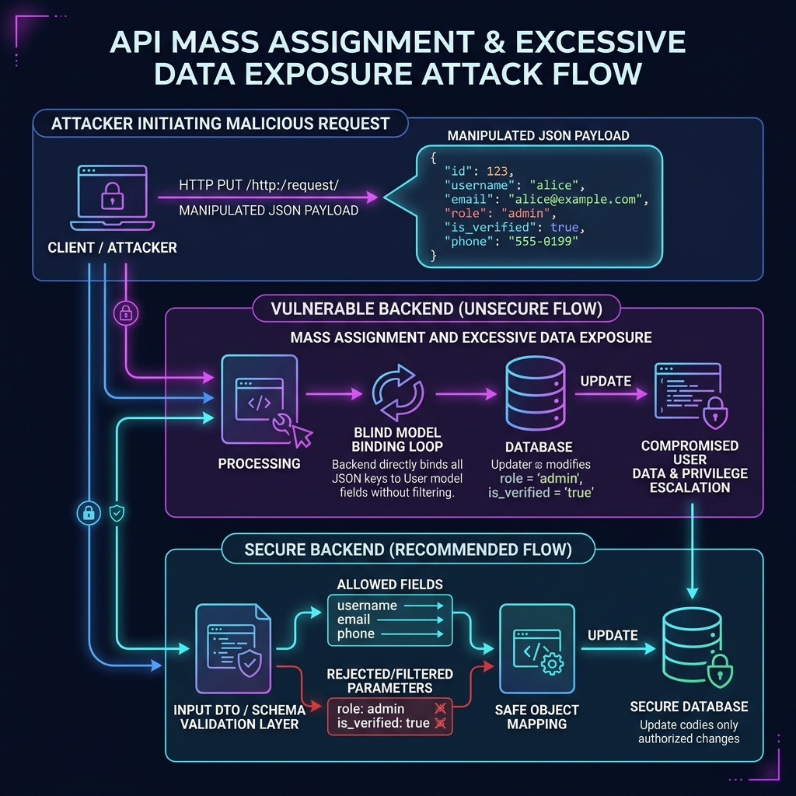

# Lab: API Mass Assignment & Excessive Data Exposure (OWASP API3:2023)

A modern AppSec lab demonstrating API Mass Assignment and Excessive Data Exposure (OWASP API3:2023) in a Node.js Express service.

## Lab Overview
This lab demonstrates how modern REST APIs are vulnerable to unauthorized attribute modification (**Mass Assignment**) and information disclosure (**Excessive Data Exposure**). You will learn how backend Node.js APIs that blindly merge client-supplied JSON payloads into database objects allow users to escalate their privileges, change sensitive fields, and extract hidden system secrets.

---

## Learning Objectives
* Understand the mechanics of **Excessive Data Exposure** (API3:2023) by inspecting raw JSON payloads.
* Learn how **Mass Assignment** vulnerabilities occur when input parameters are directly mapped onto data objects.
* Leverage API consoles and raw requests to modify parameters (e.g., `role: admin`) to escalate privileges.
* Implement remediation strategies including **Data Transfer Objects (DTOs)**, input allowlists, and explicit serialization schemas in Node.js Express.

---

## Threat Model & Attack Flow

Modern APIs frequently communicate via JSON. When updating resources (like a user profile), backends often accept the request body and apply all attributes to the database record. If the database schema holds sensitive fields (like `role` or `api_key`), and the application does not validate the input keys, an attacker can modify properties they should not have access to.



---

## Setup Instructions

### Run from GHCR
Docker images are built and published to GitHub Container Registry (GHCR) automatically. You can pull and run them directly without compiling the code locally:

```bash
# Run vulnerable build (accessible on http://127.0.0.1:8080)
docker run --rm -it \
  --name api-mass-assignment-vuln \
  -p 8080:8080 \
  ghcr.io/debaa17/cybersecurity-labs/node-api-mass-assignment:vuln

# Run fixed build (accessible on http://127.0.0.1:8081)
docker run --rm -it \
  --name api-mass-assignment-fixed \
  -p 8081:8080 \
  ghcr.io/debaa17/cybersecurity-labs/node-api-mass-assignment:fixed
```

---

### Build and Run Locally (Alternative)

If you prefer to build the containers locally:

```bash
cd labs/web-exploitation-api-mass-assignment

# Build images
docker build -t cyberlabs/api-mass-assignment:vuln -f vulnerable/Dockerfile vulnerable
docker build -t cyberlabs/api-mass-assignment:fixed -f fixed/Dockerfile fixed

# Run vulnerable image
docker run --rm -it -p 8080:8080 cyberlabs/api-mass-assignment:vuln

# Run fixed image
docker run --rm -it -p 8081:8080 cyberlabs/api-mass-assignment:fixed
```

---

## Exploitation Walkthrough

### Step 1: Register and Login
1. Open your browser and navigate to the vulnerable instance: `http://127.0.0.1:8080/`.
2. Under the **Authentication Gate** on the **Dashboard** tab, register a new account (e.g., username `hacker` and email `hacker@apex.local`).
3. Click **Create Account**. The application will automatically authenticate you, save the Bearer token in sessionStorage, and load your profile dashboard.

### Step 2: Observe Excessive Data Exposure
1. Examine the **Raw JSON API Response (GET /api/user)** panel on the right side of the dashboard.
2. Note that the API returns all properties from the database record, including keys like `api_key` and `role`:
   ```json
   {
     "id": 2,
     "username": "hacker",
     "email": "hacker@apex.local",
     "role": "user",
     "is_verified": false,
     "api_key": "APEX_USER_KEY_8a..."
   }
   ```
   *Security Issue*: Exposing `api_key` and `role` to a standard client violates the Principle of Least Privilege and represents **Excessive Data Exposure**.

### Step 3: Access Control Verification
1. Click the **Admin Panel** tab in the sidebar.
2. You will be greeted with an **Access Denied** message because your current profile role in the database is set to `user`.

### Step 4: Perform Mass Assignment Injection
1. Click the **API Console** tab in the sidebar.
2. The payload box is pre-populated with a standard profile update payload:
   ```json
   {
     "username": "hacker",
     "email": "hacker@apex.local"
   }
   ```
3. Modify the JSON body to inject the unauthorized parameters `role` and `is_verified`:
   ```json
   {
     "username": "hacker",
     "email": "hacker@apex.local",
     "role": "admin",
     "is_verified": true
   }
   ```
4. Click **Execute Call**.
5. Observe the response from the server under **Response Output**. The server processed the request with HTTP Status `200 OK` and returned the updated profile, confirming your parameters were merged into the database:
   ```json
   {
     "id": 2,
     "username": "hacker",
     "email": "hacker@apex.local",
     "role": "admin",
     "is_verified": true,
     "api_key": "APEX_USER_KEY_8a..."
   }
   ```

### Step 5: Retrieve Flag
1. Go back to the **Dashboard** tab and verify your role in the UI has updated to `ADMIN`.
2. Click the **Admin Panel** tab in the sidebar.
3. The panel is now unlocked, displaying the flag:
   **`FLAG{api_mass_assignment_priv_escalation}`**

---

## Verification Steps (Script)
You can automate this exploit and verify the security posture of both containers using the provided helper script:

```bash
chmod +x probe_mass_assignment.sh
./probe_mass_assignment.sh
```

---

## Root Cause Analysis

### Vulnerable Code (`vulnerable/app.js`)
The root cause lies in how the Node.js backend processes properties in the `PUT /api/user` controller. The code uses the JavaScript object spread operator (`...`) to blindly merge all incoming properties from `req.body` directly into the existing database user object:

```javascript
app.put('/api/user', authenticate, (req, res) => {
  const userIndex = users.findIndex(u => u.id === req.user.id);
  
  // Blind assignment updates all object properties:
  users[userIndex] = { ...users[userIndex], ...req.body };

  res.json(users[userIndex]);
});
```

Because there is no check restricting which properties can be modified, the client is given write access to the entire user object.

---

## Remediation Explanation

### 1. Strip Excessive Outputs (Output Serialization)
To resolve **Excessive Data Exposure**, the API should only serialize and return fields that the client is explicitly authorized to view. In `fixed/app.js`, this is resolved by explicitly projecting only non-sensitive fields to the response object:

```javascript
// fixed/app.js
app.get('/api/user', authenticate, (req, res) => {
  // Explicitly return only safe attributes, preventing role/api_key leakage
  const { id, username, email } = req.user;
  res.json({ id, username, email });
});
```

### 2. Restrict Input Parameters (Input DTO/Binding Allowlist)
To resolve **Mass Assignment**, enforce strict binding. Only read permitted attributes from the input payload, ignoring or rejecting any unauthorized fields:

```javascript
// fixed/app.js
app.put('/api/user', authenticate, (req, res) => {
  // 1. Enforce strict schema boundaries. Reject if extra keys exist.
  const allowedKeys = ['username', 'email'];
  const reqKeys = Object.keys(req.body || {});
  const unauthorizedKeys = reqKeys.filter(k => !allowedKeys.includes(k));

  if (unauthorizedKeys.length > 0) {
    return res.status(400).json({ 
      error: `Unauthorized fields: ${unauthorizedKeys.join(', ')}. Only 'username' and 'email' can be updated.` 
    });
  }

  // 2. Apply modifications explicitly
  const userIndex = users.findIndex(u => u.id === req.user.id);
  if (req.body.username) users[userIndex].username = req.body.username;
  if (req.body.email) users[userIndex].email = req.body.email;

  const { id, username, email } = users[userIndex];
  res.json({ id, username, email });
});
```

---

## Key Security Takeaways
1. **Never Trust Client Inputs**: Never trust client payloads to update entity attributes directly in the database without mapping them onto a strict, restricted data-binding object (Data Transfer Object).
2. **Implement API Gateways/Serializers**: Define clear input schemas (validation) and output schemas (serialization) for every API route using validation frameworks (e.g. Marshmallow, Pydantic, Zod, or direct white-listing).
3. **Database Separation**: Do not map database model definitions directly onto public-facing API interfaces.
