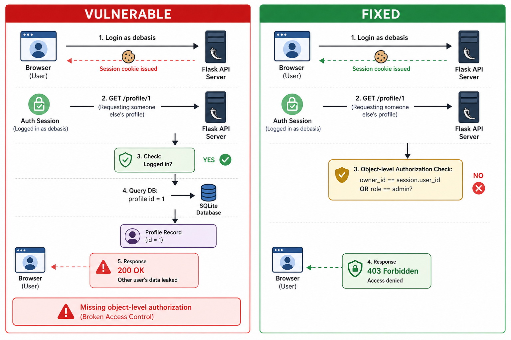

# Web Exploitation Lab (IDOR / Broken Access Control) — Flask + SQLite

A focused case study demonstrating **Broken Access Control** via an **Insecure Direct Object Reference (IDOR)**.

Two builds:

- **vulnerable**: authorization is missing on a direct object reference (`/profile/<id>`)
- **fixed**: authorization is enforced (owner-only, admin override)

## Classification

- Category: **Broken Access Control** (object-level authorization)
- Type: **horizontal privilege escalation** (user → other user’s data)

## Threat model summary

- Attackers can authenticate as a normal user.
- Attackers can change numeric IDs in URLs.
- The goal is to prevent “user A can read user B’s data”.

Key principle: **authenticate + authorize** every object access.

## Request flow diagram



## Vulnerable vs fixed (impact at a glance)

When logged in as `debasis`:

**Vulnerable** — requesting another user’s profile succeeds:

```http
GET /profile/1
HTTP/1.1 200 OK

{"display_name":"Admin","secret_note":"FLAG{...}","user_id":1}
```

**Fixed** — requesting another user’s profile is blocked:

```http
GET /profile/1
HTTP/1.1 403 FORBIDDEN

Forbidden
```

## Root cause (what actually went wrong)

Authentication exists (you must log in), but **object-level authorization is missing**.

The vulnerable endpoint uses a direct reference (`/profile/<id>`) and reads that object from the database without checking:

- does the requested object belong to the requester?
- does the requester have an explicit role/permission to access it?

This is the classic “logged-in user can access any record by changing the ID” failure mode.

## Project structure

```
web-exploitation-idor/
  README.md
  probe_idor.sh
  vulnerable/
    Dockerfile
    app/
      app.py
      requirements.txt
  fixed/
    Dockerfile
    app/
      app.py
      requirements.txt
```

---

## Run from GHCR

```bash
# Vulnerable
docker run --rm -it \
  --name flask-idor-vuln \
  -p 8080:8000 \
  ghcr.io/debaa17/cybersecurity-labs/flask-idor:vuln

# Fixed
docker run --rm -it \
  --name flask-idor-fixed \
  -p 8081:8000 \
  ghcr.io/debaa17/cybersecurity-labs/flask-idor:fixed
```

---

## Build images (vulnerable + fixed)

From this directory:

```bash
cd labs/web-exploitation-idor

# Vulnerable
docker build -t cyberlabs/flask-idor:vuln -f vulnerable/Dockerfile vulnerable

# Fixed
docker build -t cyberlabs/flask-idor:fixed -f fixed/Dockerfile fixed
```

---

## Quick reproduction (manual)

1) Run the vulnerable container (see above).

2) Log in as a normal user:

```bash
curl -i -c cookiejar.txt -X POST http://127.0.0.1:8080/login \
  -d 'username=debasis' \
  -d 'password=password1'
```

3) Fetch your own profile:

```bash
curl -i -b cookiejar.txt http://127.0.0.1:8080/profile/2
```

4) IDOR: fetch another user’s profile by changing the ID:

```bash
curl -i -b cookiejar.txt http://127.0.0.1:8080/profile/1
```

Expected: you can read the admin profile (includes a flag).

---

## Web login (browser)

There’s no UI in the container, but you can still log in via a normal browser form POST.

1) Create a local file named `login.html` with:

```html
<!doctype html>
<html>
  <body>
    <h3>IDOR Lab Login</h3>

    <!-- Vulnerable build (port 8080) -->
    <form method="POST" action="http://127.0.0.1:8080/login">
      <label>Username <input name="username" value="debasis"></label><br><br>
      <label>Password <input name="password" value="password1" type="password"></label><br><br>
      <button type="submit">Login (vulnerable)</button>
    </form>

    <hr>

    <!-- Fixed build (port 8081) -->
    <form method="POST" action="http://127.0.0.1:8081/login">
      <label>Username <input name="username" value="debasis"></label><br><br>
      <label>Password <input name="password" value="password1" type="password"></label><br><br>
      <button type="submit">Login (fixed)</button>
    </form>
  </body>
</html>
```

2) Open the file in your browser and click one of the buttons.

3) After login, in the same browser session:

- Vulnerable:
  - http://127.0.0.1:8080/profile/2 (your profile)
  - http://127.0.0.1:8080/profile/1 (IDOR)
- Fixed:
  - http://127.0.0.1:8081/profile/2 (your profile)
  - http://127.0.0.1:8081/profile/1 (should be 403)

---

## Probe script

```bash
chmod +x ./probe_idor.sh
./probe_idor.sh
```

---

## Verify the fix

Run the fixed container and retry:

```bash
curl -i -c cookiejar.txt -X POST http://127.0.0.1:8081/login \
  -d 'username=debasis' \
  -d 'password=password1'

curl -i -b cookiejar.txt http://127.0.0.1:8081/profile/1
```

Expected: `403 Forbidden`.

## Why this is vulnerable

The vulnerable build checks that you’re logged in, but it does **not** enforce object-level authorization for the requested `user_id`.

## How it’s fixed

The fixed build enforces authorization (deny-by-default):

- owner-only access (`session.user_id == requested user_id`)
- admin override (`role == admin`)

Design notes (why this scales better):

- **Deny by default**: if no rule explicitly grants access, return `403`.
- **Centralize authorization**: put checks in one place (helper / decorator / service layer) so new endpoints don’t accidentally skip it.
- **Don’t trust identifiers**: treat `/<id>` as attacker-controlled input and validate access every time.
