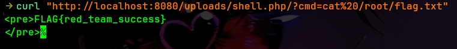

# Web Exploitation Lab (PHP Attack Chain) — File Upload + Command Injection

A minimal PHP + Apache lab that demonstrates how **risky upload handling** and **command execution from user input** can lead to full application compromise.

This lab ships two builds:

- **vulnerable**: unrestricted upload behavior + an intentionally unsafe admin tool (`/?cmd=...`)
- **fixed**: command execution removed + extension allowlist + tighter filesystem permissions


## Security Notice

This repository includes intentionally vulnerable code patterns, including command injection and file upload scenarios that may lead to remote code execution in a controlled environment.

These implementations are designed strictly for local execution inside Docker containers to demonstrate security risks and mitigation strategies.

No part of this project is intended for production use or unauthorized systems.

## Who this is for

- Beginner-to-intermediate security learners (red team *and* blue team)
- Anyone practicing how to **reason about** a web vulnerability chain (not just run tools)

## Threat model / disclaimer

- This repo is for learning/defensive training.
- Run it locally in containers only.
- The goal is compromise **inside the container**, not the host.

## What you’ll learn

- Why “we only allow safe file types” is meaningless without enforcement
- How command injection happens when request parameters drive `system()`
- How to fix these issues with allowlists, safe storage, and removing dangerous functionality

## Learning outcomes

After finishing this lab, you should be comfortable with:

- Identify **trust boundaries** and attacker-controlled inputs in a small web app
- Spot when input influences **execution context** (interpreter/runtime/OS) vs. harmless output
- Explain why “file upload” becomes critical when it enables a path from **data → code**
- Validate mitigations by re-testing the same hypothesis against a fixed build
- Explaining your results clearly (impact, root cause, remediation, and how you verified it)

## Project structure

```
web-exploitation-php-attack-chain/
	README.md
	exploit.sh
	vulnerable/
		Dockerfile
		app/
			index.php
			upload.php
	fixed/
		Dockerfile
		app/
			index.php
			upload.php
```

---

## 🚨 Remote Code Execution (RCE) Payload Reference

This lab includes a controlled payload to demonstrate how insecure file upload handling can result in remote code execution in vulnerable environments.

The payload is located at:

`docs/payload.php`

It is provided strictly as a **proof-of-concept artifact** for controlled analysis of insecure upload behavior.

---

### Usage in Lab Flow

1. Upload the payload via the vulnerable file upload endpoint  
2. If successfully stored, it becomes accessible in the web-accessible directory  
3. Trigger execution via the application context:

http://localhost:8080/uploads/payload.php?cmd=id

---

### Expected Behavior

- User-controlled input is processed by the server  
- Command output is returned in the HTTP response  
- Demonstrates lack of input validation and unsafe execution handling  

---

### Security Insight

This scenario highlights:

- Unsafe file upload handling  
- Trust boundary violations between user input and execution context  
- Lack of restrictions on executable content in web-accessible directories  

Refer to the `fixed` implementation to review mitigation strategies.


## Scenario framing (real-world simulation)

Imagine this as an internal “enterprise portal” that:

- Accepts user uploads
- Exposes some “admin convenience” functionality

That combination is common in the real world—and it’s also where small trust mistakes become big incidents.

## Assessment workflow (attacker mindset)

Approach it like a small security assessment: observe, form a hypothesis, validate, then verify the fix.

## Impact demonstration (example)

The screenshot below shows an example of the kind of impact defenders should be able to recognize and prevent:




## Run from GHCR

Images are published to GHCR by the workflow in this repo. `docker run` will pull automatically if needed.

```bash
# Vulnerable
docker run --rm -it \
	--name php-attack-chain-vuln \
	-p 8080:80 \
	ghcr.io/debaa17/cybersecurity-labs/php-attack-chain:vuln

# Fixed
docker run --rm -it \
	--name php-attack-chain-fixed \
	-p 8081:80 \
	ghcr.io/debaa17/cybersecurity-labs/php-attack-chain:fixed
```

---

Open:

- http://127.0.0.1:8080/
- http://127.0.0.1:8080/upload.php

---

## Guided investigation (vulnerable build)

Follow a realistic workflow and capture notes as you go.

1) **Recon (surface mapping)**
	- Browse the app and list endpoints/features.
	- Identify where user-controlled input enters the app (query params, uploads, filenames).

2) **Trust boundary mapping**
	- Mark where the app crosses boundaries: request → app logic, app → filesystem, app → interpreter/runtime.
	- Ask: “Can user input influence *execution* or only *display*?”

3) **Hypothesis (what could go wrong?)**
	- Form a testable statement like: “If untrusted input reaches an execution sink, I can influence server behavior.”
	- Define what evidence would confirm or refute it (response changes, server-side side effects, error modes).

4) **Validation (controlled impact demonstration)**
	- Validate whether the vulnerable build contains an execution path driven by untrusted input.
	- Record the executing context you observe (e.g., service account identity, permission boundaries).

5) **Impact statement**
	- Write 2–3 sentences describing impact **in scope** (container-only), and the data/control that becomes reachable.

6) **Fix verification plan**
	- Write the exact checks you’ll repeat against the fixed build (same inputs, same expected outcomes).

---

## Exploit walkthrough (optional script)

If you want a quick self-check, there’s a helper script in this directory: `exploit.sh`.

---

## Verify the fix

Re-run your investigation checks against the fixed build.

1) **Execution path removed**

Expected: the fixed build disables the unsafe execution behavior.

2) **Upload enforcement exists**

- Vulnerable: the upload endpoint does not enforce the “allowed formats” claim.
- Fixed: an extension allowlist rejects disallowed extensions (for example, `.php`).

---

## Why this is vulnerable

Two core issues:

1) **Command injection**

The vulnerable build executes a command directly from a request parameter, roughly:

- `system($_GET['cmd'])`

That turns a web request into arbitrary command execution.

2) **Unsafe upload handling**

The vulnerable upload accepts a user-controlled filename and does not enforce allowed types. In real systems, that often becomes:

- upload of an executable script (e.g., PHP)
- execution when it’s later accessed under the web root

---

## How it’s fixed

The fixed build applies a simple defensive posture:

- Removes the command execution feature (deny-by-default)
- Enforces a small extension allowlist on uploads
- Uses tighter filesystem permissions

## Remediation mindset (what to carry into real work)

- Prefer **removal** over “making dangerous features safer” when possible (especially anything resembling command execution).
- Treat uploads as **data**, store them safely, and validate with strict allowlists.
- Assume paths/filenames and metadata are attacker-controlled.
- Re-test after fixing: mitigation is only real when the original hypothesis no longer validates.

---

## Cleanup

```bash
docker stop php-attack-chain-vuln php-attack-chain-fixed 2>/dev/null || true
```

