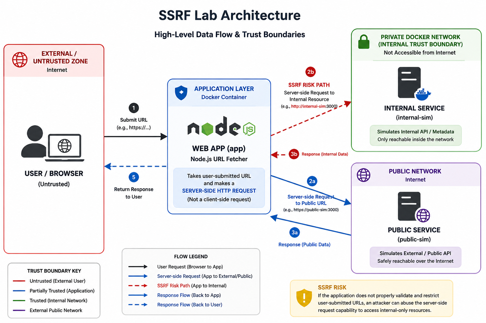

# Web Exploitation Lab (SSRF) — Node.js URL Fetcher

A small DevSecOps-focused lab demonstrating **Server-Side Request Forgery (SSRF)** in a controlled, container-only setup.

This lab ships two builds:

- **vulnerable**: the server fetches a user-supplied URL with no SSRF defenses
- **fixed**: restricts outbound destinations and blocks internal ranges/redirect tricks

## Threat model / disclaimer

- Educational and defensive only.
- Run locally with Docker in a controlled environment.
- The goal is to understand **trust boundaries** and validate mitigations, not to practice real-world exploitation.

## Architecture (what’s running)

This lab runs three containers on the same Docker network:

- `app` — the web UI where a user submits a URL
- `internal-sim` — an “internal-only” service on `http://internal-sim:9000` (simulates something you *shouldn’t* be able to reach from user input)
- `public-sim` — a safe fetch target on `http://public-sim:9100` (simulates an allowed external URL)



> Note: The diagram is a conceptual view; this lab’s simulators listen on `:9000` (`internal-sim`) and `:9100` (`public-sim`).

## SSRF in this lab (trust boundary)

SSRF happens when **untrusted client input** becomes a **server-side network request**.

- The **client** supplies `url=...`.
- The **server** fetches it using its own network access.

In the vulnerable build, the URL is accepted and fetched without meaningful constraints.

## Attack flow (vulnerable build)

1. User submits `POST /fetch` with `url=<attacker-controlled>`.
2. The server runs `fetch(url)` from inside the Docker network.
3. If the target is reachable (e.g. `http://internal-sim:9000/internal/secret`), the server fetches it.
4. The response is returned to the user.

## Impact → Root cause → Mitigation (DevSecOps summary)

## Real-world relevance

This lab demonstrates how SSRF can turn a simple URL-fetch feature into a network pivot point, allowing attackers to access internal services that are never exposed to the internet in production systems.

**Impact**
- **Internal-only service access** (internal APIs, admin panels, debug endpoints).
- **Metadata/credential exposure** (commonly cloud metadata in real systems; simulated here by `internal-sim`).
- **Server-as-a-proxy pivot** (bypass network boundaries, hide origin, perform internal recon).

**Root cause**
- A feature that performs outbound requests accepts arbitrary URLs from the client.
- Missing constraints on destination (host/IP/port) and missing enforcement of the **client → server network trust boundary**.
- Redirects and response handling can amplify the issue (e.g. `allowed → internal` redirect chains, large responses).

**Mitigation (fixed build)**
- **Allowlist** approved hostnames (default: `public-sim`).
- **DNS resolution + blocked local ranges** (e.g. loopback/link-local) to avoid trivial bypasses.
- **No redirects** to prevent `allowed → internal` redirect chains.
- **Timeout + output truncation** to reduce resource abuse.

## Mitigation notes (fixed build)

This lab’s fixed build demonstrates a practical baseline for SSRF defenses in “URL fetch” features:

- **Allowlist hostnames**: only fetch from explicitly approved destinations.
- **Resolve DNS and block local/link-local ranges**: prevent simple SSRF to loopback / link-local targets.
- **Disable redirects**: avoid `public → internal` redirect chains.
- **Timeouts + size limits**: reduce resource abuse and accidental data exfil.

In real systems, also consider:

- Egress proxies / outbound ACLs
- Separate network zones (no access from app tier to sensitive internal services)
- Observability (logs, alerting on outbound requests)
- Request normalization + canonicalization

---

## Folder structure

```
web-exploitation-ssrf/
  README.md
  docker/
    internal-sim/
      Dockerfile
      server.js
    public-sim/
      Dockerfile
      server.js
  vulnerable/
    Dockerfile
    app/
      package.json
      server.js
  fixed/
    Dockerfile
    app/
      package.json
      server.js
```

---

## Run from GHCR

```bash
docker network create cyberlabs-net 2>/dev/null || true

docker run --rm -d \
  --name internal-sim \
  --network cyberlabs-net \
  ghcr.io/debaa17/cybersecurity-labs/ssrf-internal-sim:latest

docker run --rm -d \
  --name public-sim \
  --network cyberlabs-net \
  ghcr.io/debaa17/cybersecurity-labs/ssrf-public-sim:latest

# Vulnerable (http://127.0.0.1:8080)
docker run --rm -it \
  --name ssrf-app-vuln \
  --network cyberlabs-net \
  -p 8080:8000 \
  ghcr.io/debaa17/cybersecurity-labs/ssrf-app:vuln

# Fixed (http://127.0.0.1:8081)
docker run --rm -it \
  --name ssrf-app-fixed \
  --network cyberlabs-net \
  -p 8081:8000 \
  ghcr.io/debaa17/cybersecurity-labs/ssrf-app:fixed
```

---

## Verify in the web UI (exploit vs fixed)

Vulnerable build (`http://127.0.0.1:8080/`):

- Submit a safe URL: `http://public-sim:9100/` (should return JSON mentioning `public-sim`).
- Submit an internal URL: `http://internal-sim:9000/internal/secret`.
  - In the vulnerable build this works and you’ll see `FLAG{ssrf_internal_only_demo}` in the result.

Fixed build (`http://127.0.0.1:8081/`):

- Submit `http://internal-sim:9000/internal/secret`.
  - Should be blocked with a message like: `Blocked: Host is not in the allowlist`.
- Submit `http://public-sim:9100/`.
  - Should still work.

---

## Verify via script (optional)

After starting the containers, run:

```bash
chmod +x probe_ssrf.sh
./probe_ssrf.sh
```
