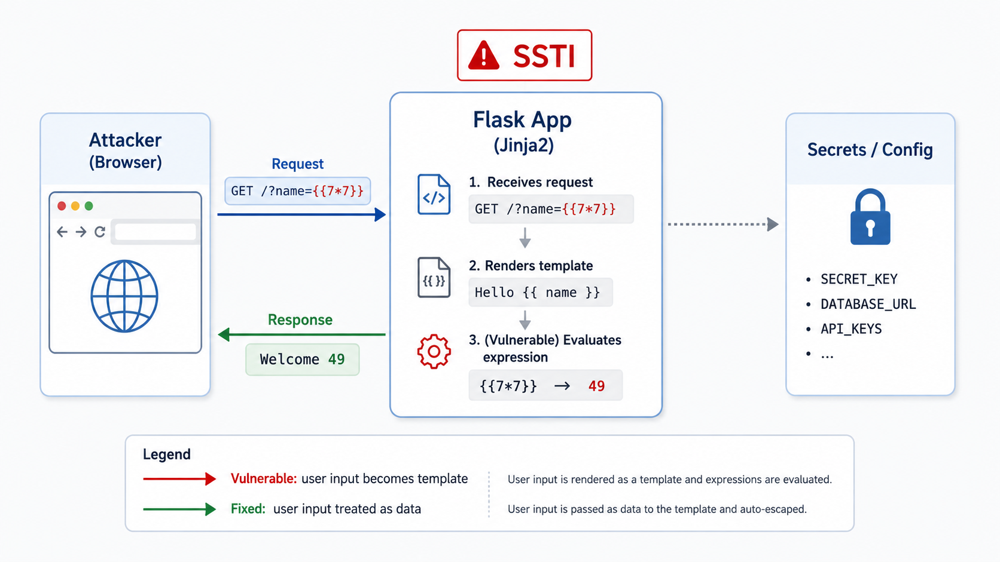

# Web Exploitation Lab (SSTI) — Flask + Jinja2

A minimal Flask app that demonstrates **Server-Side Template Injection (SSTI)** using Jinja2.

This lab ships two builds:

- **vulnerable**: user input is rendered as a template
- **fixed**: user input is treated as data and safely escaped

## What you will learn

- How SSTI happens when user input becomes a template
- How to confirm SSTI safely with simple payloads
- How to fix SSTI by separating templates from data

## Threat model / disclaimer

- Educational and defensive only.
- Run locally in Docker.
- The goal is to understand trust boundaries and validate mitigations.

## Project structure

```
web-exploitation-ssti/
  README.md
  probe_ssti.sh
  vulnerable/
    Dockerfile
    app/
      app.py
      requirements.txt
  fixed/
    Dockerfile
    app/
      app.py
      requirements.txt
```

## Screenshot



---

## Run from GHCR

Images are published to GHCR by the workflow in this repo. `docker run` will pull automatically if needed.

```bash
# Vulnerable
SECRET="FLAG{ssti_demo_secret}"
docker run --rm -it \
  --name flask-ssti-vuln \
  -e APP_SECRET="$SECRET" \
  -p 8080:8000 \
  ghcr.io/debaa17/cybersecurity-labs/flask-ssti:vuln

# Fixed
SECRET="FLAG{ssti_demo_secret}"
docker run --rm -it \
  --name flask-ssti-fixed \
  -e APP_SECRET="$SECRET" \
  -p 8081:8000 \
  ghcr.io/debaa17/cybersecurity-labs/flask-ssti:fixed
```

---

## Build images (vulnerable + fixed)

From this directory:

```bash
cd labs/web-exploitation-ssti

# Vulnerable image
docker build -t cyberlabs/flask-ssti:vuln -f vulnerable/Dockerfile vulnerable

# Fixed image
docker build -t cyberlabs/flask-ssti:fixed -f fixed/Dockerfile fixed
```

---

## Run (vulnerable)

```bash
docker run --rm -it \
  --name flask-ssti-vuln \
  -e APP_SECRET="FLAG{ssti_demo_secret}" \
  -p 8080:8000 \
  cyberlabs/flask-ssti:vuln
```

Open:

- http://127.0.0.1:8080/?name=World

### Confirm SSTI (safe payloads)

1) Basic expression evaluation:

```bash
curl -sS "http://127.0.0.1:8080/?name={{7*7}}"
```

Expected: the response contains `49`.

2) Accessing app config (sensitive):

```bash
curl -sS "http://127.0.0.1:8080/?name={{config['SECRET_KEY']}}"
```

Expected: the response leaks the configured secret.

---

## Run (fixed)

```bash
docker run --rm -it \
  --name flask-ssti-fixed \
  -e APP_SECRET="FLAG{ssti_demo_secret}" \
  -p 8081:8000 \
  cyberlabs/flask-ssti:fixed
```

Retry the same payloads against the fixed build:

```bash
curl -sS "http://127.0.0.1:8081/?name={{7*7}}"
curl -sS "http://127.0.0.1:8081/?name={{config['SECRET_KEY']}}"
```

Expected: the payloads are rendered as plain text and do not evaluate.

---

## Probe script (optional)

```bash
chmod +x ./probe_ssti.sh
./probe_ssti.sh
```

---

## Why the vulnerable build is vulnerable

The vulnerable endpoint builds a template from untrusted input, so Jinja2 evaluates attacker-supplied expressions.

## Why this differs from XSS

Short comparison:

- **XSS** executes in the browser.
- **SSTI** executes on the server.

## Root cause

- untrusted input treated as executable template content
- violated separation between templates and data
- unsafe use of `render_template_string`

## Potential impact

- sensitive configuration disclosure
- environment variable leakage
- server-side code execution risks
- application compromise

## How the fixed build mitigates this

The fixed build:

- keeps the template static
- passes user input as data
- escapes user input before rendering

## Cleanup

```bash
docker rm -f flask-ssti-vuln flask-ssti-fixed 2>/dev/null || true
```
